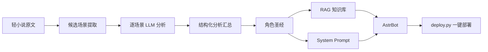

# 八奈见杏菜 角色数据管线 / Yanami Anna Character Data Pipeline

[](https://github.com/AstrBotDevs/AstrBot)
[](https://python.org)

> **从轻小说原文到 AI 角色扮演 —— 一套完整的角色数据提取、结构化分析、RAG 知识库与 AstrBot 部署管线。**
>
> **From light novel source text to AI roleplay — a complete pipeline for character data extraction, structured analysis, RAG knowledge base, and AstrBot deployment.**

---

## 📖 项目概述 / Overview

以《敗北女角太多了！》（Makeine: Too Many Losing Heroines!）中的 **八奈见杏菜 (Yanami Anna)** 为目标，构建了一套从原始文本到可部署 AI 角色的完整管线：

- **文本提取**：从轻小说 TXT/EPUB 中召回角色相关场景
- **结构化分析**：逐场景通过 LLM 抽取角色特质、情感、关系、说话风格
- **汇总建模**：生成"角色圣经"——一份供 AI 使用的人格建模文档
- **部署集成**：对接 AstrBot QQ 机器人框架，含 System Prompt、RAG 知识库、OOC 评测
- **一键部署**：`deploy/deploy.py` 脚本自动注入人格到 AstrBot

---

## 🏗️ 项目结构 / Project Structure

```
character/
├── data/
│   └── extracted/                      # 管线产出数据
│       ├── yanami_candidate_scenes.jsonl   # 452 条候选场景
│       ├── yanami_scene_analysis.jsonl     # 325 条结构化分析
│       ├── yanami_profile.md               # 角色圣经
│       └── yanami_profile_input.md
├── prompts/                          # LLM 分析 Prompt
│   ├── extract_yanami_scene.md       # 逐场景抽取 prompt
│   └── build_yanami_profile.md       # 汇总 prompt
├── scripts/                          # 数据管线脚本
│   ├── extract_yanami_candidates.py  # 候选场景提取
│   ├── workflow_extract_yanami.js    # Workflow 并行分析
│   └── ...
├── deploy/                           # 🚀 部署文件
│   ├── deploy.py                     # 一键部署脚本 ← 从这里开始
│   ├── system_prompt.md              # AstrBot System Prompt
│   ├── yanami_full_knowledge.md      # RAG 知识库 (完整版)
│   ├── yanami_rag.md                 # RAG 知识库 (精简话题版)
│   ├── ooc_checklist.md              # OOC 检查清单
│   ├── ooc_eval_report.md            # OOC 预评估报告
│   └── quickstart.md                 # 快速上手指南
└── README.md
```

---

## 🚀 快速开始 / Quick Start

### 前置条件

- AstrBot 4.x 已安装并运行；如果还没有部署 AstrBot，请先看官方文档：[通过源码部署 AstrBot](https://docs.astrbot.app/deploy/astrbot/cli.html)
- Python 3.10+
- Git（用于 clone 本仓库；没有 Git 也可以下载 ZIP）
- AstrBot 已完成基础初始化：配置 AI 对话模型、配置平台机器人（QQ/Telegram/飞书等）
- 一个支持 OpenAI 兼容 Embedding API 的提供商（如 硅基流动，免费额度够用）

### 本项目不会自动完成的事

这些步骤涉及你的本机环境、平台账号或 API Key，需要用户自己完成：

1. **部署 AstrBot 本体**  
   参考官方文档：[通过源码部署 AstrBot](https://docs.astrbot.app/deploy/astrbot/cli.html)。官方文档说明源码部署需要 Python `>=3.10`，可用 Git 克隆仓库，也可以下载源码解压；启动后默认管理面板地址通常是 `http://localhost:6185`。

2. **配置 AI 对话模型**  
   在 AstrBot 仪表盘中完成“配置 AI 模型”。本仓库不提供聊天模型 API Key。

3. **配置平台机器人**  
   在 AstrBot 仪表盘中完成“配置平台机器人”，例如接入 QQ、Telegram、飞书等。平台账号、机器人 Token、QQ 接入方式都需要你自己准备。

4. **配置 Embedding Provider**  
   RAG 知识库需要 embedding 模型。本仓库只提供知识库文档，不提供 embedding API Key。

5. **上传知识库文档并重启 AstrBot**  
   `deploy/deploy.py` 会安装人格，但知识库文档仍需在 AstrBot 知识库界面上传。

### 一键部署

```bash
cd character
python deploy/deploy.py
```

脚本会自动：
1. 检测 AstrBot 安装和运行状态
2. 将八奈见杏菜人格注入 AstrBot 数据库
3. 设置为默认人格
4. 给出后续配置指引（Embedding Provider + 知识库上传）

它不会自动安装 AstrBot、创建 QQ 机器人、申请 API Key 或上传知识库文件。

### 后续手工步骤

部署脚本完成后，你还需要：

**① 配置 Embedding Provider（用于 RAG 知识库）**

进 AstrBot 仪表盘 → 模型提供商 → 嵌入 → 新增模型提供商：

| 配置项 | 值 |
|--------|-----|
| API Base URL | `https://api.siliconflow.cn/v1` |
| Model | `BAAI/bge-m3` |
| API Key | 去 [SiliconFlow](https://siliconflow.cn) 注册获取 |

**② 上传知识库**

仪表盘 → 知识库 → 新建 → 选好 embedding 模型 → 保存 → 上传文档 → 选 `deploy/yanami_full_knowledge.md`

**③ 重启 AstrBot 服务**

---

## 📋 管线流程 / Pipeline



---

## 📊 管线统计 / Statistics

| 指标 | 值 |
|------|-----|
| 原始候选场景 | 452 |
| 有用场景 | 325 (71.9%) |
| 覆盖范围 | 第 1 卷 ~ 第 7 卷 + 短篇/特典 |
| 角色圣经 | 6,573 字, 13 章节 |
| RAG 知识库 | 324 KB, 4,399 行 |
| OOC 一致性评分 | 4.8/5 |
| System Prompt | 1,684 字 |

---

## 🔧 扩展 / Extension

### 添加新卷

```bash
# 1. 将新卷 TXT 放入 data/novels/
# 2. 重新提取候选场景
python scripts/extract_yanami_candidates.py

# 3. 运行 Workflow 分析（需 Claude Code）
#    或手动逐条使用 prompts/extract_yanami_scene.md

# 4. 重建知识库
python scripts/build_full_kb.py
```

### 适配其他角色

修改 `scripts/extract_yanami_candidates.py` 中的 `ALIASES` 为目标角色名，按相同流程执行。

---

## 📄 许可证 / License

MIT License

## 🙏 致谢

- [AstrBot](https://github.com/AstrBotDevs/AstrBot) - QQ 机器人框架
- 《敗北女角太多了！》- 雨森焚火

---

> **免责声明**: 所有角色分析数据基于原作文本的结构化提取。角色版权归原作者及出版社。本项目仅用于技术研究和学习。
